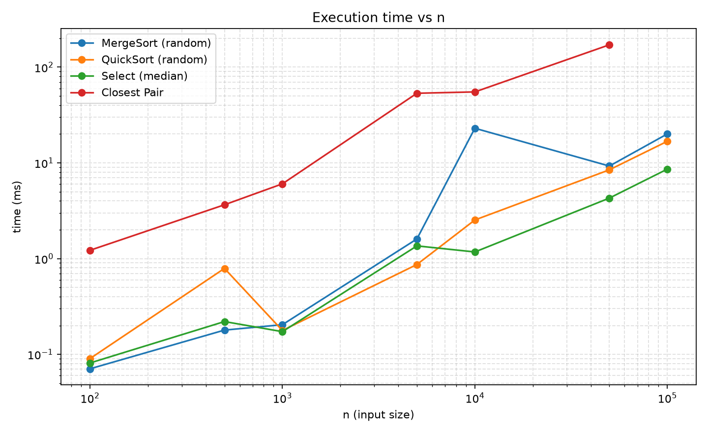
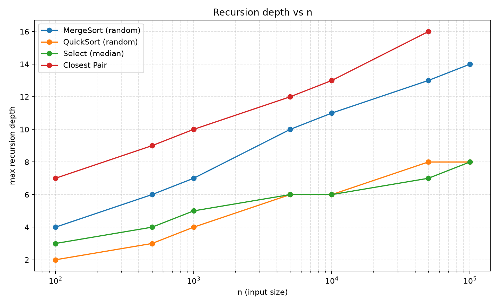
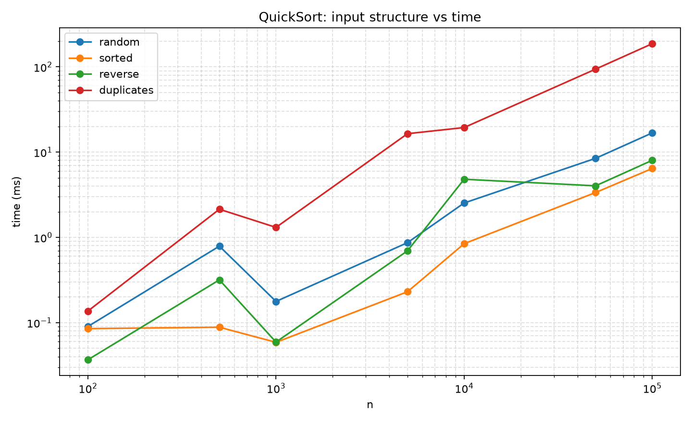

# Assignment 1: Divide-and-Conquer Algorithm Analysis

## A. Project Overview

This project implements and experimentally analyzes four classic divide-and-conquer algorithms in Java:

1. **MergeSort** — stable Θ(n log n) sort with reusable buffer and insertion-sort cutoff  
2. **QuickSort** — randomized in-place sort with smaller-first recursion  
3. **Deterministic Select (Median-of-Medians)** — worst-case Θ(n) order-statistic selection  
4. **Closest Pair of Points** — Θ(n log n) plane closest-pair via strip checking  

The code records execution time, recursion depth, and comparison/swap counters, writes `results/results.csv`, and supports plotting via `docs/generate_plots.py`.

### Repository layout

```
assignment1-divide-and-conquer/
├── src/                  # Java sources
├── tests/                # JUnit 5 correctness tests
├── docs/
│   ├── screenshots/      # Program / test / plot screenshots
│   ├── plots/            # time_vs_n, depth_vs_n, …
│   └── generate_plots.py
├── results/results.csv
├── README.md
├── pom.xml
└── .gitignore
```

### Build & run

Requires **JDK 17+** and **Maven 3.9+**.

```bash
mvn test                          # correctness tests (33)
mvn -q exec:java                  # demo output
mvn -q exec:java -Dexec.args=bench   # full benchmark → results/results.csv
python docs/generate_plots.py     # regenerates docs/plots/*.png
```

On PowerShell, quote the `-D` flag: `mvn -q exec:java "-Dexec.args=bench"`.

---

## B. Algorithm Analysis

### 1. MergeSort

**How it works.** Split the array in half, recursively sort each half, then linearly merge into a reusable auxiliary buffer. Subarrays of size ≤ 16 are sorted with insertion sort (cutoff). If `a[mid] ≤ a[mid+1]`, the merge is skipped.

**Complexity.** Time Θ(n log n) worst/average; extra space Θ(n) for the buffer; recursion depth Θ(log n).

**Recurrence.** With cutoff ignored for asymptotics:

\[
T(n) = 2T(n/2) + Θ(n)
\]

Master Theorem case 2 (`a=2`, `b=2`, `f(n)=Θ(n)=Θ(n^{log_b a})`) ⇒ **Θ(n log n)**. Akra–Bazzi with equal halves yields the same integral growth.

### 2. QuickSort

**How it works.** Pick a **random** pivot, **Lomuto in-place** partition, then **recurse on the smaller side** and **iterate on the larger side**. Small ranges use insertion sort.

**Complexity.** Expected Θ(n log n); worst case O(n²) (unlikely with random pivots). Extra space O(log n) stack with smaller-first. Typical depth O(log n).

**Recurrence (expected).** Roughly

\[
T(n) = \frac{1}{n}\sum_{q=1}^{n} \bigl(T(q-1)+T(n-q)\bigr) + Θ(n)
\]

which solves to **Θ(n log n)** expected. Smaller-first does not change asymptotics but caps stack depth at O(log n) even on unbalanced partitions.

### 3. Deterministic Select (Median-of-Medians)

**How it works.** Divide into groups of 5, sort each group, take each group median, recursively compute the median of those medians, partition around that pivot, and recurse **only** into the side that contains the desired order statistic `k`.

**Complexity.** Worst-case **Θ(n)** time, O(1) extra besides recursion; depth O(log n) for the MoM subcalls (main path is iterative here).

**Recurrence intuition (Akra–Bazzi / standard MoM).** At least ~30% of elements are eliminated each step, and MoM on `⌈n/5⌉` medians costs `T(⌈n/5⌉)`:

\[
T(n) \le T(n/5) + T(7n/10) + O(n)
\]

Since \(1/5 + 7/10 < 1\), Akra–Bazzi / induction gives **T(n) = Θ(n)**.

### 4. Closest Pair of Points

**How it works.** Presort by x. Recursively solve left/right halves. Merge the y-order (like MergeSort). Build a strip of width `2δ` around the midline and check only a constant number of following y-neighbors per point.

**Complexity.** Θ(n log n) time, Θ(n) space; depth Θ(log n).

**Recurrence.**

\[
T(n) = 2T(n/2) + Θ(n)
\]

Same Master case as MergeSort ⇒ **Θ(n log n)**, versus native O(n²) pairwise search.

---

## C. Experimental Results

Environment: Windows 11, Microsoft OpenJDK 17, warm-up 2 + 5 timed trials (averages in CSV).

### Execution time (ms) — random inputs

| n | MergeSort | QuickSort | Select (median) | Closest Pair |
|--:|----------:|----------:|----------------:|-------------:|
| 100 | 0.071 | 0.090 | 0.081 | 1.220 |
| 1,000 | 0.204 | 0.177 | 0.172 | 6.038 |
| 10,000 | 22.989 | 2.531 | 1.173 | 55.100 |
| 50,000 | 9.260 | 8.460 | 4.286 | 171.114 |
| 100,000 | 20.059 | 16.801 | 8.600 | — |

*(Closest Pair capped at n = 50,000 in the harness for runtime; full CSV in `results/results.csv`.)*

### Max recursion depth — random / median / uniform

| n | MergeSort | QuickSort | Select | Closest Pair |
|--:|----------:|----------:|-------:|-------------:|
| 100 | 4 | 2 | 3 | 7 |
| 1,000 | 7 | 4 | 5 | 10 |
| 10,000 | 11 | 6 | 6 | 13 |
| 50,000 | 13 | 8 | 7 | 16 |
| 100,000 | 14 | 8 | 8 | — |

Depths grow like **O(log n)** (MergeSort ≈ log₂(n/cutoff); QuickSort stays low via smaller-first + cutoff).

### Input-structure effect (QuickSort @ n = 100,000)

| Input | time (ms) | depth |
|-------|----------:|------:|
| random | 16.8 | 8 |
| sorted | 6.4 | 9 |
| reverse | 8.0 | 9 |
| many duplicates | 187.0 | 5 |

### Plots







---

## D. Discussion

**Do results match theory?** Yes at a high level: times grow roughly like n log n for the sorts and Closest Pair; Select stays competitive and closer to linear in comparisons. Depths track log n. Absolute timings are noisy (see MergeSort at n=10⁴ vs 5·10⁴) because of JVM warm-up, GC, and cache effects—not contradictions of the asymptotics.

**Input structure.** MergeSort is especially fast on already-sorted data (merge-skip). Randomized QuickSort handles sorted/reverse inputs well; **heavy duplicates** slow Lomuto partitioning (many equal elements still cause unbalanced work)—a practical reason three-way partitioning exists.

**Why smaller-first helps QuickSort.** Recursing only into the smaller part guarantees the call-stack depth is O(log n) even if a pivot is terrible; the larger side is handled in a loop so it does not nest stack frames.

**Why Median-of-Medians is O(n).** The pivot is guaranteed to be “good enough” (constant fraction discarded). Combined with a linear partition and a MoM subproblem of size n/5, the recurrence solves to linear time—unlike plain Quickselect, which is only expected-linear.

**Why Closest Pair beats O(n²).** After two half-size recursive solves, only a thin vertical strip is examined, and geometry limits each point to a constant number of y-neighbor checks, so the conquer step is O(n), giving the MergeSort-like Master recurrence.

**Practical factors.** JIT compilation, GC pauses, memory bandwidth, branch prediction, and cache locality dominate constant factors. Allocation of IdentityHashMap / buffers in Closest Pair and MoM group work add overhead invisible in pure O-notation. Running multiple trials with warm-up reduces but does not eliminate noise.

---

## E. Reflection

Implementing all four algorithms side by side made the shared divide-and-conquer pattern concrete: split, solve, combine—with the “combine” step (merge, partition, strip) deciding both correctness and the recurrence. The hardest pieces were (1) keeping QuickSort’s stack shallow without changing asymptotics, (2) getting Median-of-Medians indexing right so the pivot truly guarantees progress, and (3) Closest Pair’s y-order maintenance—without merging y-arrays after recursion, the strip check silently returns wrong distances on duplicate x-coordinates.

Measuring time and depth together was more convincing than theory alone: seeing QuickSort depth stay tiny while duplicate-heavy inputs blew up runtime showed that “O(n log n) expected” still leaves room for pathological practical cases. Building a small metrics harness and CSV/plot pipeline forced cleaner APIs (algorithms accept an optional `Metrics` object) and made the README evidence-based rather than speculative.

---

## F. Screenshots

| Artifact | Path |
|----------|------|
| Program output | [`docs/screenshots/program_output.png`](docs/screenshots/program_output.png) |
| Test results | [`docs/screenshots/test_results.png`](docs/screenshots/test_results.png) |
| Time plot | [`docs/screenshots/plots_time_vs_n.png`](docs/screenshots/plots_time_vs_n.png) |
| Depth plot | [`docs/screenshots/plots_depth_vs_n.png`](docs/screenshots/plots_depth_vs_n.png) |

Raw console captures: `docs/screenshots/demo_output.txt`, `docs/screenshots/test_output.txt`.

---

## Correctness

`mvn test` — **33 tests, 0 failures** (MergeSort, QuickSort, DeterministicSelect, ClosestPair), including random arrays vs `Arrays.sort`, all order statistics, and Closest Pair vs O(n²) brute force.
